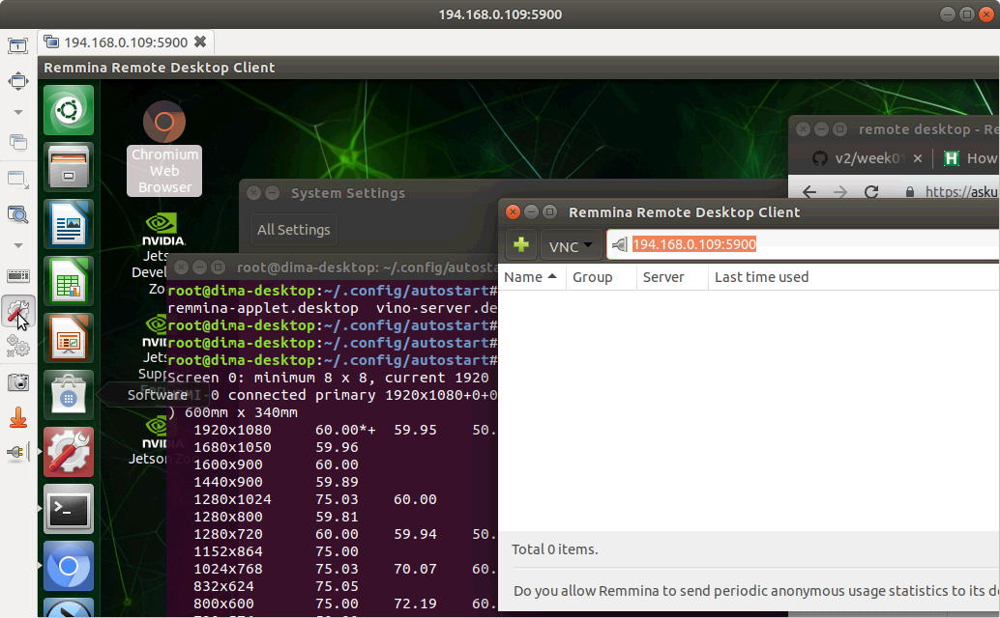

# HW 1: Installing Jetpack and Docker 


## 1. Nvidia Jetpack SDK
Jetpack is an SDK that basically contains everything needed for deep learning and AI applications in a handy package bundle containing the OS for for the Jetson. Installation on the Jetson requires downloading and installing both on the Jetson (the target) and an Ubuntu computer (the host).

In the Fall of 2019, we are moving to the latest Jetpack 4.2.1.  There may be some rough air ahead, please buckle your seatbelts!


### Host (Computer) Installation
You will need a machine running Ubuntu 16.04 or Ubuntu 18.04. If you do not have one, you will need to create a VM running Ubuntu.

#### VM Installation (if needed)
Download Virtual Box [here](https://www.virtualbox.org/wiki/Downloads) or VMware Workstation (Windows) or VMware Fusion (Mac) [here](https://my.vmware.com/web/vmware/downloads) and the extension to give VMs access to your USB hubs [here](https://download.virtualbox.org/virtualbox/6.0.6/Oracle_VM_VirtualBox_Extension_Pack-6.0.6.vbox-extpack). We recommend VMware for stability, but it only allows 30 days of use without a license.

Download the Ubuntu 18.04 iso image [here](http://releases.ubuntu.com/18.04/ubuntu-18.04.3-desktop-amd64.iso). 

Create a new VM in VMware/Virtual Box. 

For Virtual Box, select "New" in the upper left corner. Make sure the type and version are "Linux" and "Ubuntu 64-bit". When prompted, choose to create a virtual hard disk and VDI as the type. For VMware, select File -> New, then drag & drop the ISO file to the VMware window.

The size of the disk should be 55GB absolutely minimum. Give the VM 2-4 cores to make sure cross-compilation does not take forever, and at least 4-8G of RAM. 

NOTE: if you are on Windows and are not seeing the 64-bit option for VMs, please look [here](https://forums.virtualbox.org/viewtopic.php?f=1&t=62339).  Unfortunately, Docker on Windows does not currently support USB. Therefore, you can't use it, which leads you to having to install VirtualBox and disabling HyperV, per the instructions, if it was previously enabled.

Virtual Box Only: With the VM now created, highlight it in the menu and select "Settings" in the upper right. In Network > Adapter 1, change "Attached to" to "Bridged Adapter". In Ports > USB, ensure "Enable USB Controller" is under "USB 3.0 (xHCI) Controller". In System > Processor, enable 2 CPU cores. Now select "Start" in the upper right. When prompted to select a start-up disk, browse and select the Ubuntu image you downloaded. Follow the rest of the instructions to complete setting up the Ubuntu VM. Afterwards, enter the Virtualbox Preferences menu and go to the "Extensions" section. Find and enable the Extension Pack. 

**Note: if you are using a VM, you need to ensure the VM can see the Jetson by placing the Jetson into force recovery mode. First ensure the Jetson is completely off and connected to the host computer via USB cable. Press the power button once to power on the Jetson and then hold the FORCE RECOVERY button. While holding this button, press the RESET button once. Hold the FORCE RECOVERY button for 2 more seconds, then release. Tip: the FORCE RECOVERY button is the button next to the power button, and the RESET button is the button on the opposite end of the row.**

**Now open the VM settings, go to Ports > USB, click "Add new USB filters...etc", and add "NVIDIA Corp. APX". When in the VM, use "lsusb" in the terminal to check if the Jetson is visible.**

#### Installation on Ubuntu
Navigate to [Jetpack homepage](https://developer.nvidia.com/embedded/jetpack) and click on "Download Nvidia SDK Manager". Once it downloads, install it (we recommend using the Ubuntu software install gui which automatically resolves dependencies) and then open the freshly installed application. It can be opened by running "sdkmanager" from a terminal command line.

You will need to stick to the default settings except:
* Select "Jetson TX2" (NOT the less powerful TX2i) as the target device
* Select "Manual" and place your TX2 into the recovery mode as mentioned above.

The process of fetching the software and decompressing it will take some time, depending on the speed of your workstation and your internet connection. It took me 15 min on my old 2011 Toshiba portege ultralight notebook over a 120 Mbit cable modem.  Once the OS image is built and flashed to the Jetson, you will need to log into the newly flashed Jetson using a keyboard, mouse, and monitor attached to it and complete the OS set up; specifically, create a userid and password.  Then, you need to get back to the installer and type them in.  The installer will copy a few additional files to the Jetson at that point, decompress them, set them up. This took me another 15 min (jetpack 4.2.1).

**IF you have problems with the install**
On Step 02, select "DOWNLOAD & INSTALL OPTIONS" and click on "Download Now, Install Later". Then ensure all packages download successfully, which may take several attempts. Then proceed to Step 03 in the installer.

When installation on the Jetson is done, close the installer as prompted and you're done. You could shut down and even remove your VM at this point.

### Testing Jetpack on the Jetson
Ensure the Jetson is on and running Ubuntu. Use this command to verify that everything is happy and healthy:

```
sudo nvpmodel -q --verbose
```

The output should be similar to:

```
NVPM VERB: Config file: /etc/nvpmodel.conf
NVPM VERB: parsing done for /etc/nvpmodel.conf
NVPM VERB: Current mode: NV Power Mode: MAXP_CORE_ARM
3
NVPM VERB: PARAM CPU_ONLINE: ARG CORE_1: PATH /sys/devices/system/cpu/cpu1/online: REAL_VAL: 0 CONF_VAL: 0
NVPM VERB: PARAM CPU_ONLINE: ARG CORE_2: PATH /sys/devices/system/cpu/cpu2/online: REAL_VAL: 0 CONF_VAL: 0
NVPM VERB: PARAM CPU_ONLINE: ARG CORE_3: PATH /sys/devices/system/cpu/cpu3/online: REAL_VAL: 1 CONF_VAL: 1
NVPM VERB: PARAM CPU_ONLINE: ARG CORE_4: PATH /sys/devices/system/cpu/cpu4/online: REAL_VAL: 1 CONF_VAL: 1
NVPM VERB: PARAM CPU_ONLINE: ARG CORE_5: PATH /sys/devices/system/cpu/cpu5/online: REAL_VAL: 1 CONF_VAL: 1
NVPM VERB: PARAM CPU_A57: ARG MIN_FREQ: PATH /sys/devices/system/cpu/cpu0/cpufreq/scaling_min_freq: REAL_VAL: 2035200 CONF_VAL: 0
NVPM VERB: PARAM CPU_A57: ARG MAX_FREQ: PATH /sys/devices/system/cpu/cpu0/cpufreq/scaling_max_freq: REAL_VAL: 2035200 CONF_VAL: 2000000
NVPM VERB: PARAM GPU: ARG MIN_FREQ: PATH /sys/devices/17000000.gp10b/devfreq/17000000.gp10b/min_freq: REAL_VAL: 1134750000 CONF_VAL: 0
NVPM VERB: PARAM GPU: ARG MAX_FREQ: PATH /sys/devices/17000000.gp10b/devfreq/17000000.gp10b/max_freq: REAL_VAL: 1134750000 CONF_VAL: 1120000000
NVPM VERB: PARAM EMC: ARG MAX_FREQ: PATH /sys/kernel/nvpmodel_emc_cap/emc_iso_cap: REAL_VAL: 1600000000 CONF_VAL: 1600000000
```
### Exploring the power modes of the Jetson
The Jetson SoCs has a number of different power modes described in some detail here: [TX2](https://www.jetsonhacks.com/2017/03/25/nvpmodel-nvidia-jetson-tx2-development-kit/) or [Xavier](https://www.jetsonhacks.com/2018/10/07/nvpmodel-nvidia-jetson-agx-xavier-developer-kit/). The main idea is that the lowering clock speeds on the cpu and turning off cores saves energy; and the default power mode is a low energy mode. You need to switch to a higher power mode to use all cores and maximize the clock frequency.
  
## 2. Docker 
Docker is a platform that allows you to create, deploy, and run applications in containers. The application and all its dependecies are packaged into one container that is easy to ship out and uses the same Linux kernel as the system it's running on, unlike a virtual machine. This makes it especially useful for compact platforms such as the Jetson.

Jetpack 4.2.1 has Docker pre-installed.

Let's test it to see if it can run containers. Since the Jetson doesn't have the image below yet, Docker will automatically pull it online from the official repository:
```
sudo docker run hello-world
```

### Linking Docker to an External Drive (required)
The Jetson SoC has limited storage (only 16G), so linking Docker to an external drive is the only choice to store all your Docker work. A SSD is strongly recommended to speed up processes. We will need to move the directory that Docker uses to store its images and containers to this SSD.

Plug in your SSD. What is it called?
```
fdisk -l
# Among many entries, you shoud see something like this:
Disk /dev/sda: 465.8 GiB, 500107862016 bytes, 976773168 sectors
Units: sectors of 1 * 512 = 512 bytes
Sector size (logical/physical): 512 bytes / 4096 bytes
I/O size (minimum/optimal): 4096 bytes / 4096 bytes
```
In this case, our disk is called /dev/sda. Your disk may be named differently. Format it:
```
# first, create the mountpoint!
mkdir -m 777 /data
mkfs.ext4 /dev/sda
```
Let's create an entry in fstab so that the disk will be auto-mounted on restart:
```
# edit /etc/fstab and all this line:
/dev/sda /data                   ext4    defaults,noatime        0 0
```
Now, mount your SSD!
```
mount /data
```


The Docker files on the Jetson are in /var/lib/docker. We need to stop Docker and then move the Docker directory stored on the Jetson (in /var/lib/docker) to the external drive. You might want to back up this directory first somewhere in case of errors.
```
sudo service docker stop
mv /var/lib/docker /data/docker
```
Create a symbolic link between the Docker directory you just moved onto on the external drive to a new softlink that Docker on the Jetson will refer to when pulling files:
```
sudo ln -s /data/docker /var/lib/docker
sudo service docker start
```
Now your Docker work will automatically be stored on this external drive. The new "docker" directory in /var/lib is a softlink: every time Docker calls on that, it'll actually be pulling from the original "docker" directory in the external drive. Just remember to hook it up when working with Docker.

### Creating a swap file pointing to the external drive (recommended)
If you have an external drive, your TX2 can function as a small desktop. Let's enable swap to complete the picture, so that you can start multiple jobs in parallel (assuming that only one is active at a time, you should have reasonable performance):
```
# assuming your hard drive is mounted to /data
# and that you want to create a 24G swap file (3 times the memory, which is ok.  Assuming that your hard drive is 500G, this should be easy)
# become root
fallocate -l 24.0G /data/swapfile
chmod 600 /data/swapfile
mkswap /data/swapfile
swapon /data/swapfile
# confirm that your swap is working:
free -m
# You should see something like:
#               total        used        free      shared  buff/cache   available
# Mem:           7852        5050        1522          20        1279        2597
# Swap:         24575           0       24575

# Now, edit /etc/fstab and add the following line:
/data/swapfile  none    swap    0       0
# Finally, reboot
reboot
# Once the tx2 starts, type free -m again to make sure that your swap is working
# Happy swapping!
```
  
### Run the base Docker Image for the Jetson
Most of the work  in the class will require a Docker base image running Ubuntu 18.04 with all the needed dependencies. For the first time, in July 2019, Nvidia has released an officially supported base container! Please register at the [Nvidia GPU Cloud](http://ngc.nvidia.com) and review the documentation for the [base jetson container](https://ngc.nvidia.com/catalog/containers/nvidia:l4t-base)

Let's start the container:
```
# allow remote X connections
xhost +
sudo docker run -it --rm --net=host --runtime nvidia  -e DISPLAY=$DISPLAY -v /tmp/.X11-unix/:/tmp/.X11-unix nvcr.io/nvidia/l4t-base:r32.2
# this should complete successfully. Once you are convinced that you are inside the Docker container (e.g. try to list the contents of your home directory), just exit from it:
exit
```

Note for future reference that the Docker images for jetpacks 4.2 that we used in earlier sessions of W251 are still available in the docker hub as ```w251/cuda:tx2-4.2_b158``` and ```w251/cuda:dev-tx2-4.2_b158```. In the docker hub you will find other versions of these containers as well. 

We'll cover Docker during the in-class lab in more detail.

### Setting up screen sharing for the Jetson
You will need to have a keyboard, mouse, and monitor attached to your Jetson; but it is also extremely convenient to set up screen sharing, so you can see the Jetson desktop remotely. This is needed, for instance, when you want to show Jetson's screen over a web conference - plus it's a lot easier than switching between monitors all the time.

1.  Get a screen sharing client.  If you are on a Mac, you should all set; it's located under System Preferences / Sharing.  If you are on Windows, you can install [TightVNC](https://www.tightvnc.com/) or another VNC client of your choice. On Linux, you can use [Remmina](https://remmina.org/), which you likely already have installed.
2. Configure your Jetson for remote screen sharing.
* Launch the desktop sharing utility:


* Allow other users to view / control your desktop, requre the user to enter password:


* Has the desktop sharing utility **still** crashed for you? We would imagine this will be fixed at some point. Here is the workaround:
```
mkdir ~/.config/autostart
```
* Now, edit ```~/.config/autostart/vino-server.desktop``` and insert the following:
```
[Desktop Entry]
Type=Application
Name=Vino VNC server
Exec=/usr/lib/vino/vino-server
NoDisplay=true
```

* Disable security:
```
gsettings set org.gnome.Vino prompt-enabled false
gsettings set org.gnome.Vino require-encryption false
```

* The default resolution is 1920x1080. If you still want to change it (optional):
```
sudo xrandr --fb 1600x900
```
* Reboot your Jetson
* Then, launch your remote sharing client, choose VNC as the protocol, type in the IP address of your jetson and port 5900:


You should now be able to connect without entering a password. However, should you reboot your Jetson, you will need to use the attached mouse and keyboard and actually log into it so that the vino-server starts up. Only then will you be able to connect to it remotely again.
* We noticed that with Jetpack 4.2.1, when connecting via Remmina, the initial resolution is too low.  You can change it by clicking the Preferences gear icon to the left of the screen, like this:



Set it to "best"
# To turn in
Please send a message on the class portal homework submission page indicating that you were able to set up your Jetson
