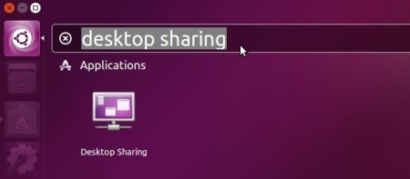
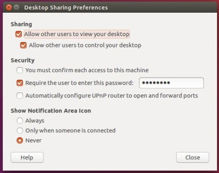

# HW 1: Installing Jetpack and Docker 

## 1. Nvidia Jetpack SDK
Jetpack is a SDK that basically contains everything needed for deep learning and AI applications in a handy package for the Jetson. Installation on the Jetson requires downloading and installing both on the Jetson (the target) and an Ubuntu computer (the host).
All of the following must be done in an Ubuntu OS. If a command is ever permission denied, try adding "sudo" at the beginning.
Refer to https://docs.nvidia.com/jetson/archives/jetpack-archived/jetpack-33/index.html for more detailed instructions (these are for Jetpack 3.3 on the Jetson TX2).

### Host (Computer) Installation
To reiterate, you will need a machine running Ubuntu 16.04 or Ubuntu 18.04. If you do not have one, you will need to create a VM running Ubuntu.

#### VM Installation (if needed)
Download Virtual Box [here](https://www.virtualbox.org/wiki/Downloads) and the extension to give VMs access to your USB hubs [here](https://download.virtualbox.org/virtualbox/6.0.6/Oracle_VM_VirtualBox_Extension_Pack-6.0.6.vbox-extpack). First download the Ubuntu 16.04 iso image [here](http://releases.ubuntu.com/16.04/ubuntu-16.04.5-desktop-amd64.iso). Open Virtual Box and select "New" in the upper left corner. Make sure the type and version are "Linux" and "Ubuntu 64-bit". When prompted, choose to create a virtual hard disk and VDI as the type. The size of the disk should be 55GB absolutely minimum.  

NOTE: if you are on Windows and are not seeing the 64-bit option for VMs, please look [here](https://forums.virtualbox.org/viewtopic.php?f=1&t=62339).  Unfortunately, Docker on Windows does not currently support USB. Therefore, you can't use it, which leads you to having to install VirtualBox and disabling HyperV, per the instructions, if it was previously enabled.

With the VM now created, highlight it in the menu and select "Settings" in the upper right. In Network > Adapter 1, change "Attached to" to "Bridged Adapter". In Ports > USB, ensure "Enable USB Controller" is under "USB 3.0 (xHCI) Controller". In System > Processor, enable 2 CPU cores.

Now select "Start" in the upper right. When prompted to select a start-up disk, browse and select the Ubuntu image you downloaded. Follow the rest of the instructions to complete setting up the Ubuntu VM. Afterwards, enter the Virtualbox Preferences menu and go to the "Extensions" section. Find and enable the Extension Pack. 

**Note: if you are using a VM, you need to ensure the VM can see the Jetson by placing the Jetson into force recovery mode. First ensure the Jetson is completely off and connected to the host computer via USB cable. Press the power button once to power on the Jetson and then hold the FORCE RECOVERY button. While holding this button, press the RESET button once. Hold the FORCE RECOVERY button for 2 more seconds, then release. Tip: the FORCE RECOVERY button is the button next to the power button, and the RESET button is the button on the opposite end of the row.**

**Now open the VM settings, go to Ports > USB, click "Add new USB filters...etc", and add "NVIDIA Corp. APX". When in the VM, use "lsusb" in the terminal to check if the Jetson is visible.**

#### Installation on Ubuntu
Open a terminal window and create a new directory to store installation packages. Now download the latest version of Jetpack from the Nvidia webiste (you need to make a Nvidia Developer's account first). The download is a Linux executable file (.run file type). Move the file into the directory you just made, then cd into that directory. Add exec permission for this Jetpack file (replace the <> with the name of the file):
```
chmod +x <Jetpack file name>
```
Run the file (remember to replace the <>):
```
./<Jetpack file name>
```
The install wizard window should open, click "next". The next window displays the installation locations, which should already be the directory you are currently in. Next window, select the correct Jetson version (TX2 as of now, maybe Jetson Xavier). 

The next window is the components manager, where you can see what actions will be performed to the host and target. You can troubleshoot here for errors if needed. For now, click "next" at the bottom right and then check "accept all" in the following terms and conditions popup. You'll be taken back to the components manager and everything will begin to download. There may be an error message during download; just dismiss it and click "next" again. A message will prompt you to monitor the computer during installation, and click "ok" to begin cross-compilation. After the cross-compilation is done and the OS image for the Jetson is created, the wizard will now do target hardware setup (the Jetson). 

### Target (Jetson) Installation

On the host computer, select the "Device accesses Internet via router/switch" option. The next window prompts you to select the correct network interface corresponding to the router that the Jetson is also connected to. To view these, open up another terminal window and bring up a list of the interfaces with this command:
```
ifconfig
```
Find the one which points to the router. It usually has "inet addr: 192.168.<somenumbers>" in the second line of the description and the name often looks like "wlp<somenumbers>". Select that interface from the drop-down menu in the install wizard. The next window displays the actions the install will take, click "next". 

Follow the instructions on the new window to put the Jetson into Force USB Recovery Mode. The FORCE RECOVERY button is the button next to the power button, and the RESET button is the button on the opposite end of the row. 
**Note: if you are using a VM, open the VM settings, go to Ports > USB, and make sure "NVIDIA Corp. APX" is on the list and checked.**
Afterwards, check if the Jetson is on Force USB Recovery Mode by listing the USB buses in the host computer:
```
lsusb
```
You should see "NVidia Corp" in the list of devices. Go back to the window with instructions and press "enter" to begin flashing the OS on the Jetson's internal storage. 

After flashing, the host computer will install Jetpack modules onto the Jetson via ssh. If the host computer can't find the IP address of the Jetson, it will give you options to try again or enter the IP address manually. Keep trying again, but if this keeps failing then check the Jetson's IP address and enter it manually. 

**If using a VM and the process freezes at "Determining IP address", exit the installer and run it again via terminal. This time, change the "Flash OS Image to Target" option to "No Action" in the components manager. When prompted to enter IP address, User Name, and Password, boot up the Jetson and connect it to a monitor. Ensure it is connected to the same router as the host computer. Now check its IP address by clicking the WiFi symbol in the upper right corner of the home screen and choosing the "Connection Information" option." The password and user name are both "nvidia".**

When installation on the Jetson is done, close the window as prompted and you're done.

### Testing Jetpack on the Jetson
Ensure the Jetson is on and running Ubuntu. Use ls to check the directory name where the CUDA samples are (it looks likes "NVIDIA_CUDA-<version>" replacing the <> with the CUDA version you have). Then cd into it and run the oceanFTT sample:
```
cd NVIDIA_CUDA-<version>_Samples/bin/aarch64/linux/release/
./oceanFFT
```
### Exploring the power modes of the Jetson
The Jetson SoCs has a number of different power modes described in some detail here: [TX2](https://www.jetsonhacks.com/2017/03/25/nvpmodel-nvidia-jetson-tx2-development-kit/) or [Xavier](https://www.jetsonhacks.com/2018/10/07/nvpmodel-nvidia-jetson-agx-xavier-developer-kit/). The main idea is that the lowering clock speeds on the cpu and turning off cores saves energy; and the default power mode is a low energy mode. You need to switch to a higher power mode to use all cores and maximize the clock frequency.
  
## 2. Docker 
Docker is a platform that allows you to create, deploy, and run applications in containers. The application and all its dependecies are packaged into one container that is easy to ship out and uses the same Linux kernel as the system it's running on, unlike a virtual machine. This makes it especially useful for compact platforms such as the Jetson.

### Downloading Docker onto the Jetson
Navigate to the /etc/apt directory. There should be a executable file there called "sources.list". Open it and add the following to the bottom:
```
deb [arch=amd64] https://download.docker.com/linux/ubuntu xenial stable
```
If the file is read-only (it won't let you save changes), open a terminal and give yourself permission to edit the file:
```
sudo chmod a+rwx sources.list
```
Now update the package lists and install Docker. If Docker is already on the Jetson, a message in the terminal will tell you it's "already installed".
```
sudo apt-get update
sudo apt-get install docker.io
```
Let's test Docker to see if it can run containers. Since the Jetson doesn't have the image yet, Docker will automatically pull it online from the official repository:
```
docker run arm64v8/hello-world
```

### Linking Docker to an External Drive (recommended)
The Jetson has limited storage, so linking Docker to an external drive is a good choice to store all your Docker work. A SSD is recommended to speed up processes. The Docker files on the Jetson are in /var/lib/docker. Plug an external drive into the Jetson and check its location and name (usually /media/nvidia/<drivename>). Now stop Docker and then move the Docker directory stored on the Jetson (in /var/lib/docker) to the external drive. You might want to back up this directory first somewhere in case of errors.
```
sudo service docker stop
mv /var/lib/docker /media/nvidia/<drivename>
```
Create a symbolic link between the Docker directory you just moved onto on the external drive to a new softlink that Docker on the Jetson will refer to when pulling files:
```
sudo ln -s /media/nvidia/<drivename>/docker /var/lib/docker
sudo service docker start
```
Now your Docker work will automatically be stored on this external drive. The new "docker" directory in /var/lib is a softlink: every time Docker calls on that, it'll actually be pulling from the original "docker" directory in the external drive. Just remember to hook it up when working with Docker.

**NOTE: You'll have to manually mount your external drive and start Docker every time you reboot the Jetson if you use the external drive this way. You might want to have Ubuntu mount your external drive automatically every time you reboot by adding a line to the /etc/fstab file ([See here for more info on how to mount with the fstab file](https://help.ubuntu.com/community/Fstab)).**
  
### Creating a base CUDA Docker Image for the Jetson
Most of the work later in the class will require a Docker base image running Ubuntu 16.04 with all the needed dependencies. On the Jetson, create a new directory to store the Dockerfile for this cudabase image, download the Dockerfile.cudabase3.0 file on Github in week1/hw, and place it in the new directory. Ensure you are in the new directory and run the following:
```
docker build -t cudabase -f Dockerfile.cudabase3.0 .
```
After a while, the image is created. List the current images to see if it worked:
```
docker images
```
We'll cover Docker in the lab in more detail.

### Setting up screen sharing for the Jetson
You will need to have a keyboard, mouse, and monitor attached to your Jetson; but it is also extremely convenient to set up screen sharing, so you can see the Jetson desktop remotely. This is needed, for instance, when you want to show Jetson's screen over a web conference - plus it's a lot easier than switching between monitors all the time.

1.  Get a screen sharing client.  If you are on a Mac, you should all set; it's located under System Preferences / Sharing.  If you are on Windows, you can install [TightVNC](https://www.tightvnc.com/) or another VNC client of your choice. On Linux, you can use [Remmina](https://remmina.org/), which you likely already have installed.
2. Configure your Jetson for remote screen sharing.
* Launch the desktop sharing utility:


* Allow other users to view / control your desktop, requre the user to enter password:


* Disable security if you are coming in through windows:
```
dconf write /org/gnome/desktop/remote-access/require-encryption false 
```
* Then, launch your client, type in the IP address of your jetson and port 5900.  You should now be able to connect!
# To turn in
Please send a message on the class portal homework submission page indicating that you were able to set up your Jetson
