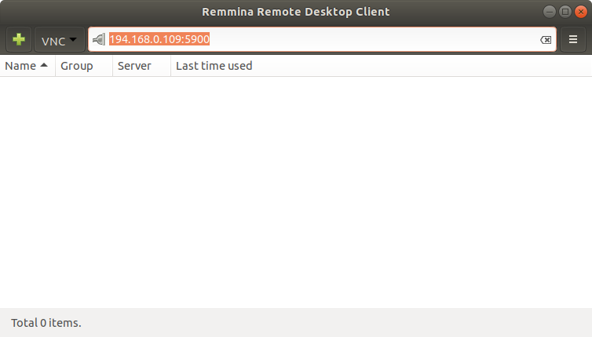

# HW 1: Installing Jetpack and Docker 


## 1. Nvidia Jetpack SDK
Jetpack is an SDK that basically contains everything needed for deep learning and AI applications in a handy package bundle containing the OS for for the Xavier. Installation on the Xavier requires downloading and flashing the image to a MicroSD card.

Required equipment:

 1. MicroSD card (64GB minimum size)
 2. USB MicroSD card reader
 3. NVMe M.2 SSD (256GB minimum size) **NOTE: SATA M.2 SSDs will not work**
 4. Size 0 Philips head screwdriver
 5. Micro USB to USB cable
 6. USB Webcam


### 1.1 Host (Computer) Installation

On your Windows, Mac, or Ubuntu workstation, navigate to the [Jetpack homepage](https://developer.nvidia.com/embedded/jetpack) and click on "Download SD Card Image" in the `JETSON XAVIER NX DEVELOPER KIT` box. Once it downloads, follow the steps at [Getting Started with Jetson Xavier NX Developer Kit](https://developer.nvidia.com/embedded/learn/get-started-jetson-xavier-nx-devkit) to flash the SD card.

NVIDIA provides [flashing instructions](https://developer.nvidia.com/embedded/learn/get-started-jetson-xavier-nx-devkit#write) for Windows, Linux, and Mac. You will need to insert the MicroSD card into the card reader and connect it to the USB port on your computer.

**While the flashing process runs, you can use the Philips head screwdriver to install the SSD on your Xavier NX.**

A quick video showing MicroSD card and SSD installation is [here](Xavier_NX_Install_SSD.mp4).

Once the flashing process is complete, you will insert the MicroSD card into your Xavier. **Do not power it on yet.**


### 1.2 Post-flash setup

There are two setup options. 

 1. Use a USB keyboard/mouse and HDMI display
 2. Use a tty terminal from Mac or Linux

With the first option, you will obviously need additional hardware. Option number two is quite easy, though, and we will walk you through the process.

If you choose option two, you will need a machine running Linux (we recommend Ubuntu 18.04), or a Mac. If you do not have one, you can create a VM running Ubuntu (see section 1.2).

If you are using install option one, you can connect the keyboard, mouse, and display to [complete the setup process](https://developer.nvidia.com/embedded/learn/get-started-jetson-xavier-nx-devkit#setup). Once they are connected, you can connect the power adapter. Follow the steps to complete the setup and then go to section 2. If you have issues connecting to wifi, skip that step and connect the Xavier directly to your router with an ethernet cable **after** the setup is complete.

If you are using install option two, you can connect the Xavier to your Mac or Linux computer using the micro-USB cable and then connect the power adapter.

**If you are using a VMware VM, you will be prompted to connect the USB device to your host computer or the VM; choose the VM. When in the VM, use "lsusb" in the terminal to check if the Xavier is visible.**

### 1.3 VM Installation (if needed)
You get a free VMware subscription through Berkeley [here](https://software.berkeley.edu/vmware). Download and install VMware Workstation (for Windows) or VMware Fusion (for macOS).

Download the Ubuntu 18.04 iso image [here](http://releases.ubuntu.com/18.04/ubuntu-18.04.3-desktop-amd64.iso). 

Create a new VM in VMware. 

Walk-through on VMware image creation is [here](CreateUbuntuVMInVMware.mp4).

**VM Configuration**, the size of the disk should be 40GB absolutely minimum. Give the VM 2-4 cores to make sure cross-compilation does not take forever, and at least 4-8G of RAM. 


#### 1.3.1 Mac: 
Run this command from the Mac Terminal application:

```
ls -ls /dev/cu.*
```

You should see a `usbmodem` device like:

```
/dev/cu.usbmodem14210200096973
```

You will use the `screen` command to connect to the tty device:

```
screen /dev/cu.usbmode* 115200 -L
```

#### 1.3.2 Linux:
Run this command from the Linux terminal application:

```
ls -ls /dev/ttyA*
```

You should see a `ttyACM` device like:

```
/dev/ttyACM0
```
You will use the `screen` command to connect to the tty device:

```
sudo apt-get install -y screen
sudo screen /dev/ttyACM0 115200 -L
```

### 1.4 Both Linux and Mac:
**Note: the wifi configuration might not work due to a bug in the software. If it is an issue, just skip the wifi step and connect the Xavier directly to your router with an ethernet cable after the setup is complete**

You will finish the [setup process](https://developer.nvidia.com/embedded/learn/get-started-jetson-xavier-nx-devkit#setup) using the tty terminal you just opened to the device. 

## 2. Configure VNC

It is highly recommended that you connect your Xavier directly to your router with an ethernet cable.

You can have a keyboard, mouse, and monitor attached to your Jetson; but it is also extremely convenient to set up screen sharing, so you can see the Jetson desktop remotely. This is needed, for instance, when you want to show Jetson's screen over a web conference - plus it's a lot easier than switching between monitors all the time.

1.  Get a VNC screen sharing client.  You can install [TightVNC](https://www.tightvnc.com/), [Remmina](https://remmina.org/), or another VNC client of your choice. 
2. Configure your Xavier for remote screen sharing.

On your Xavier, open a terminal (or ssh to your Xavier from another computer). 

```
mkdir ~/.config/autostart
```
* Now, edit ```~/.config/autostart/vino-server.desktop``` and insert the following:

```
[Desktop Entry]
Type=Application
Name=Vino VNC server
Exec=/usr/lib/vino/vino-server
NoDisplay=true
```

* Disable security:

```
gsettings set org.gnome.Vino prompt-enabled false
gsettings set org.gnome.Vino require-encryption false
```

* Enable automatic login by editing /etc/gdm3/custom.conf and add the following (the AutomaticLogin ID should be the user ID you created in the setup):

```
# Enabling automatic login
  AutomaticLoginEnable = true
  AutomaticLogin = nvidia # Ensure that you replace 'nvidia' with your ID
```


* Reboot your Xavier
* Then, launch your remote sharing client, choose VNC as the protocol, type in the IP address of your jetson and port 5900:



* The default resolution is very small. You can change it with this command (required after every reboot):

```
sudo xrandr --fb 1600x900 # you can choose some other resolution if desired
```


### Testing Jetpack on the Xavier
Ensure the Xavier is on and running Ubuntu. Use this command to verify that everything is happy and healthy:

```
sudo nvpmodel -q --verbose
```

The output should be similar to:

```
NVPM VERB: Config file: /etc/nvpmodel.conf
NVPM VERB: parsing done for /etc/nvpmodel.conf
NV Fan Mode:quiet
NVPM VERB: Current mode: NV Power Mode: MODE_15W_6CORE
2
NVPM VERB: PARAM CPU_ONLINE: ARG CORE_0: PATH /sys/devices/system/cpu/cpu0/online: REAL_VAL: 1 CONF_VAL: 1
NVPM VERB: PARAM CPU_ONLINE: ARG CORE_1: PATH /sys/devices/system/cpu/cpu1/online: REAL_VAL: 1 CONF_VAL: 1
NVPM VERB: PARAM CPU_ONLINE: ARG CORE_2: PATH /sys/devices/system/cpu/cpu2/online: REAL_VAL: 1 CONF_VAL: 1
NVPM VERB: PARAM CPU_ONLINE: ARG CORE_3: PATH /sys/devices/system/cpu/cpu3/online: REAL_VAL: 1 CONF_VAL: 1
NVPM VERB: PARAM CPU_ONLINE: ARG CORE_4: PATH /sys/devices/system/cpu/cpu4/online: REAL_VAL: 1 CONF_VAL: 1
NVPM VERB: PARAM CPU_ONLINE: ARG CORE_5: PATH /sys/devices/system/cpu/cpu5/online: REAL_VAL: 1 CONF_VAL: 1
NVPM VERB: PARAM TPC_POWER_GATING: ARG TPC_PG_MASK: PATH /sys/devices/gpu.0/tpc_pg_mask: REAL_VAL: 2 CONF_VAL: 1
NVPM VERB: PARAM GPU_POWER_CONTROL_ENABLE: ARG GPU_PWR_CNTL_EN: PATH /sys/devices/gpu.0/power/control: REAL_VAL: auto CONF_VAL: on
NVPM VERB: PARAM CPU_DENVER_0: ARG MIN_FREQ: PATH /sys/devices/system/cpu/cpu0/cpufreq/scaling_min_freq: REAL_VAL: 1190400 CONF_VAL: 1190400
NVPM VERB: PARAM CPU_DENVER_0: ARG MAX_FREQ: PATH /sys/devices/system/cpu/cpu0/cpufreq/scaling_max_freq: REAL_VAL: 1420800 CONF_VAL: 1420800
NVPM VERB: PARAM CPU_DENVER_1: ARG MIN_FREQ: PATH /sys/devices/system/cpu/cpu2/cpufreq/scaling_min_freq: REAL_VAL: 1190400 CONF_VAL: 1190400
NVPM VERB: PARAM CPU_DENVER_1: ARG MAX_FREQ: PATH /sys/devices/system/cpu/cpu2/cpufreq/scaling_max_freq: REAL_VAL: 1420800 CONF_VAL: 1420800
NVPM VERB: PARAM CPU_DENVER_2: ARG MIN_FREQ: PATH /sys/devices/system/cpu/cpu4/cpufreq/scaling_min_freq: REAL_VAL: 1190400 CONF_VAL: 1190400
NVPM VERB: PARAM CPU_DENVER_2: ARG MAX_FREQ: PATH /sys/devices/system/cpu/cpu4/cpufreq/scaling_max_freq: REAL_VAL: 1420800 CONF_VAL: 1420800
NVPM VERB: PARAM GPU: ARG MIN_FREQ: PATH /sys/devices/17000000.gv11b/devfreq/17000000.gv11b/min_freq: REAL_VAL: 114750000 CONF_VAL: 0
NVPM VERB: PARAM GPU: ARG MAX_FREQ: PATH /sys/devices/17000000.gv11b/devfreq/17000000.gv11b/max_freq: REAL_VAL: 1109250000 CONF_VAL: 1109250000
NVPM VERB: PARAM GPU_POWER_CONTROL_DISABLE: ARG GPU_PWR_CNTL_DIS: PATH /sys/devices/gpu.0/power/control: REAL_VAL: auto CONF_VAL: auto
NVPM VERB: PARAM EMC: ARG MAX_FREQ: PATH /sys/kernel/nvpmodel_emc_cap/emc_iso_cap: REAL_VAL: 1600000000 CONF_VAL: 1600000000
NVPM VERB: PARAM DLA_CORE: ARG MAX_FREQ: PATH /sys/kernel/nvpmodel_emc_cap/nafll_dla: REAL_VAL: 1100800000 CONF_VAL: 1100800000
NVPM VERB: PARAM DLA_FALCON: ARG MAX_FREQ: PATH /sys/kernel/nvpmodel_emc_cap/nafll_dla_falcon: REAL_VAL: 640000000 CONF_VAL: 640000000
NVPM VERB: PARAM PVA_VPS: ARG MAX_FREQ: PATH /sys/kernel/nvpmodel_emc_cap/nafll_pva_vps: REAL_VAL: 819200000 CONF_VAL: 819200000
NVPM VERB: PARAM PVA_CORE: ARG MAX_FREQ: PATH /sys/kernel/nvpmodel_emc_cap/nafll_pva_core: REAL_VAL: 601600000 CONF_VAL: 601600000
NVPM VERB: PARAM CVNAS: ARG MAX_FREQ: PATH /sys/kernel/nvpmodel_emc_cap/nafll_cvnas: REAL_VAL: 576000000 CONF_VAL: 576000000

```

### Exploring the power modes of the Jetson
The Jetson line of SoCs (including the Xavier NX) has a number of different power modes described in some detail here: [TX2](https://www.jetsonhacks.com/2017/03/25/nvpmodel-nvidia-jetson-tx2-development-kit/) or [Xavier](https://www.jetsonhacks.com/2018/10/07/nvpmodel-nvidia-jetson-agx-xavier-developer-kit/). The main idea is that the lowering clock speeds on the cpu and turning off cores saves energy; and the default power mode is a low energy mode. You need to switch to a higher power mode to use all cores and maximize the clock frequency.  In the upper right corner of your desktop you will see a widget that should allow you to switch between power modes.  Set your power mode to MAXN; this will enable all six cores and will maximize your clock frequency. This is ok when we use our Xavier as a small desktop computer.  If you decide to use your Xavier as a robotic device and become worried about the power draw, you may want to lower this setting.

## 3. Configure Operating System to run from SSD

Your Xavier is booting the Operating System from the MicroSD card, which is not very fast.

We recommend that you configure your system to run from the SSD instead. Follow the instructions on [this page](https://www.jetsonhacks.com/2020/05/29/jetson-xavier-nx-run-from-ssd/) (watch the video carefully).

Use the `configure_xavier.sh` script in this repo to set up swap space after you have rebooted and are running your Operating System from the SSD.


  
## 4. Docker 
Docker is a platform that allows you to create, deploy, and run applications in containers. The application and all its dependecies are packaged into one container that is easy to ship out and uses the same Linux kernel as the system it's running on, unlike a virtual machine. This makes it especially useful for compact platforms such as the Jetson.

Jetpack 4.3 has Docker pre-installed, and has an experimental nvidia-docker support.

Let's test it to see if it can run containers. Since the Jetson doesn't have the docker image 'hello-world' downloaded yet, Docker will automatically pull it online from the official repository:

```
docker run hello-world
```
  
### Run the base Docker Image for the Jetson
Most of the work  in the class will require a Docker base image running Ubuntu 18.04 with all the needed dependencies. For the first time, in July 2019, Nvidia has released an officially supported base cuda container! Please register at the [Nvidia GPU Cloud](http://ngc.nvidia.com) and review the documentation for the [base jetson container](https://ngc.nvidia.com/catalog/containers/nvidia:l4t-base)

Let's start this container:

```
# allow remote X connections
xhost +
docker run -it --rm --net=host --runtime nvidia  -e DISPLAY=$DISPLAY -v /tmp/.X11-unix/:/tmp/.X11-unix nvcr.io/nvidia/l4t-base:r32.4.3
# this should complete successfully. Run this command to verify that you are inside the Docker container

ls
# You should see the following:
# bin  boot  dev  dst  etc  home  lib  media  mnt  opt  proc  root  run  sbin  srv  sys  tmp  usr  var

# Now exit from the container:
exit
```
More on the use of this beta container is [here](https://github.com/NVIDIA/nvidia-docker/wiki/NVIDIA-Container-Runtime-on-Jetson)

Note that our own Docker images for the Jetsons are still available in the [docker hub](https://cloud.docker.com/u/w251/), e.g.  ```w251/cuda:tx2-4.3_b132``` and ```w251/cuda:dev-tx2-4.3_b132```. As the officially supported containers mature, we expect to sunset these; but for now, it looks like we'll be needing them. We keep Dockerfiles for all of our containers [here](https://github.com/MIDS-scaling-up/v2/tree/master/backup) for your reference.

We'll cover Docker during the in-class lab in more detail.


# To turn in
Please send a message on the class portal homework submission page indicating that you were able to set up your Jetson
