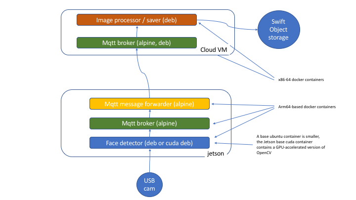

# Homework 3 - Internet of Things 101

## Please note that this homework is graded

## Instructions
The objective of this homework is to build a lightweight IoT application pipeline with components running both on the edge (your Nvidia Jetson TX2) and the cloud (a VM in Softlayer).  We also request that you pay attention to the architecture: write the application in a modular way, and such that it could be run on pretty much any low power edge device or hub (e.g. Raspberry Pi or Raspberry Pi Zero) and a cheap Cloud VM - or, indeed, another low power edge device connected to some kind of storage instead of a Cloud VM. 


The overall goal of the assignment is to be able to capture faces in a video stream coming from the edge in real time, transmit them to the cloud in real time, and - for now, just save these faces in the cloud for long term storage.


Throughout the assignment, we request that you use Docker to package all components as portable microservices.  On the TX2, we request that you use [Alpine Linux](https://alpinelinux.org/) as the base OS for your containers as it is frugal in terms of storage. Please recall that Jetson TX2 devices and Raspberry Pis are both based on the [ARM v8 architecture](https://en.wikichip.org/wiki/arm/armv8) as opposed to Intel x86/64 architecture.


For the edge face detector component, we ask that you use OpenCV and write an application that scans the video frames coming from the connected USB camera for faces. When one or more faces are detected in the frame, the application should cut them out of the frame and send via a binary message each.


Because the context of this class is IoT, we request that you use MQTT as the messaging fabric.  So, you will be using an MQTT client to send and receive messages, and MQTT broker as the server component of this architecture.


We also ask that you treat the TX2 as an IoT Hub.  Therefore, we ask that you install a local MQTT broker in the TX2, and that your face detector sends its messages to this broker first.  Then, we ask that you write another component that receives these messages from the local broker, and sends them to the cloud [MQTT broker].

In the cloud, you need to provision a lightweight virtual machine (1-2 CPUs and 2-4 G of RAM should suffice) and run an MQTT broker. As discussed above, the faces will need to be sent here as binary messages.  Another component will need to be created here to receive these binary files and save them to SoftLayer's Object storage (note that the Swift-compatible object storage is being deprecated in favor of s3-compatible object storage). 


Please don't be intimidated by this homework as it is mostly a learning experience on the building blocks. The concept of the Internet of Things deals with a large number of devices that communicate largely through messaging. Here, we have just one device and one sensor- the camera.  But, we could add a bunch more sensors like microphones, GPS, proximity sensors, lidars...

## Alpine Linux 101
[Alpine Linux](https://alpinelinux.org/) is a very lightweight Linux distro for IoT.  Its [base docker containers](https://hub.docker.com/_/alpine) are tiny, often measured in single digit megabytes, as opposed to the often bloated Debian-based distros. A TX2 is a powerful device, but there will be times when network connectivity matters, and Alpine will come very handy.

To see whether the package you need is available on alpine's package manager, apk, check [this link](https://pkgs.alpinelinux.org/packages)

## MQTT 101
MQTT - http://mqtt.org/ is a lightweight messaging protocol for the Internet of Things. You send messages to topics and there are just three simple QoS settings: 0,1, and 2.  Please familiarize yourself with these. Here's a [nice page on MQTT QoS](https://www.hivemq.com/blog/mqtt-essentials-part-6-mqtt-quality-of-service-levels/) and another one [on MQTT topics](https://www.hivemq.com/blog/mqtt-essentials-part-5-mqtt-topics-best-practices/) that go over MQTT best practices.


### Mosquitto
Perhaps the most popular OpenSource MQTT toolkit is called Mosquitto. It is extremely lightweight and fast. 
To install the client on a Debian distro, for instance, you would do this:
```
sudo apt install -y mosquitto-clients
```

Or, if you want to install the broker, you need to do this:
```
sudo apt install -y mosquitto
```

On Alpine Linux, you would do instead:
```
apk add mosquitto
```

Note that mqtt uses port 1883 for un-encrypted messages.


To see what packages are available on Alpine linux for Mosquitto, you would do something like [this](https://pkgs.alpinelinux.org/packages?name=mosquitto&branch=edge)

### Subscribing to messages on an MQTT Broker via mosquitto_sub
To subscribe to a topic tree on an MQTT broker, we do something like this:

```
mosquitto_sub -t applications/in/+/public/# -h <ip address of the MQTT broker>
```

This matches `applications/in/app1/public` as well as `applications/in/app2/public/subtopic`, etc. etc.

### MQTT via python
You don't need to use Python, in fact, perhaps it's more fun to just use command line tools like mosquitto_sub and mosquitto_pub; but it's obviously better to use Python.  Here's a simple template on how to use [Paho-MQTT](https://pypi.org/project/paho-mqtt/):
```
import paho.mqtt.client as mqtt


LOCAL_MQTT_HOST="mosquitto"
LOCAL_MQTT_PORT=1883
LOCAL_MQTT_TOPIC="test_topic"

def on_connect_local(client, userdata, flags, rc):
        print("connected to local broker with rc: " + str(rc))
        client.subscribe(LOCAL_MQTT_TOPIC)
	
def on_message(client,userdata, msg):
  try:
    print("message received!")	
    # if we wanted to re-publish this message, something like this should work
    # msg = msg.payload
    # remote_mqttclient.publish(REMOTE_MQTT_TOPIC, payload=msg, qos=0, retain=False)
  except:
    print("Unexpected error:", sys.exc_info()[0])

local_mqttclient = mqtt.Client()
local_mqttclient.on_connect = on_connect_local
local_mqttclient.connect(LOCAL_MQTT_HOST, LOCAL_MQTT_PORT, 60)
local_mqttclient.on_message = on_message


# go into a loop
local_mqttclient.loop_forever()

```

## OpenCV
[OpenCV](https://opencv.org/) is THE library for computer vision.  At the moment it has fallen behind the Deep Learning curve, but it could catch up at any moment.  For traditional, non-DL image processing, it is unmatched.

### Facial detection with OpenCV 
We suggest that you use a simple pre-trained frontal face HAAR Cascade Classifier [documented here](https://docs.opencv.org/3.4.1/d7/d8b/tutorial_py_face_detection.html).  There is no need to detect eyes,just the face.  Notice how simple it is to use:
```
import numpy as np
import cv2 as cv
face_cascade = cv.CascadeClassifier('haarcascade_frontalface_default.xml')

# gray here is the gray frame you will be getting from a camera
gray = cv.cvtColor(gray, cv.COLOR_BGR2GRAY)
faces = face_cascade.detectMultiScale(gray, 1.3, 5)
for (x,y,w,h) in faces:
	# your logic goes here; for instance
	# cut out face from the frame.. 
	# rc,png = cv2.imencode('.png', face)
	# msg = png.tobytes()
	# ...
```

```
Note, you can find the OpenCV cascade files on the tx2 in the directory /usr/share/OpenCV/haarcascades
```

### Reading video from a USB webcam
This really is super-simple. You read videos one frame at a time.  The example below follows [this tutorial](https://docs.opencv.org/3.0-beta/doc/py_tutorials/py_gui/py_video_display/py_video_display.html):
```
import numpy as np
import cv2

# 1 should correspond to /dev/video1 , your USB camera. The 0 is reserved for the TX2 onboard camera
cap = cv2.VideoCapture(0)

while(True):
    # Capture frame-by-frame
    ret, frame = cap.read()

    # We don't use the color information, so might as well save space
    gray = cv2.cvtColor(frame, cv2.COLOR_BGR2GRAY)
    # face detection and other logic goes here
``` 
## Linking containers
As you can see from the architecture diagram below, you will need to make multiple docker containers inside your TX2 and you need them to work together.  Please review the [docker networking tutorial](https://docs.docker.com/network/network-tutorial-standalone/#use-user-defined-bridge-networks).  The idea is that you will need to create a local bridge network and then the containers you will create will join it, e.g.
```
# Create a bridge:
docker network create --driver bridge hw03
# Create an alpine linux - based mosquitto container:
docker run --name mosquitto --network hw03 -p 1883:1883 -ti alpine sh
# we are inside the container now
# install mosquitto
apk update && apk add mosquitto
# run mosquitto
/usr/sbin/mosquitto
# Press Control-P Control-Q to disconnect from the container

# Create an alpine linux - based message forwarder container:
docker run --name forwarder --network hw03 -ti alpine sh
# we are inside the container now
# install mosquitto-clients
apk update && apk add mosquitto-clients
ping mosquitto
# this should work - note that we are referring to the mosquitto container by name
mosquitto_sub -h mosquitto -t <some topic>
# the above should block until some messages arrive
# Press Control-P Control-Q to disconnect from the container
```


## Overall architecture / flow
Your overall application flow / architecture should be something like .  

On the TX2, you should have a mosquitto broker container, based on Alpine linux.  Also, a container for the face detector that connects to the USB webcam, detects faces, and sends them to your internal Mosquitto broker. You should have another container that fetches face files from the internal broker and sends them to the cloud mosquitto broker.  This container should be based on Alpine linux.  In the cloud, you should have a container with a mosquitto broker running inside.  You should also have a container that connects to the cloud mosquitto broker, gets face messages, and puts them into the object storage.

## Submission
Please point us to the repository of your code and provide an http link to the location of your faces in the object storage.  Also, explan the naming of the MQTT topics and the QoS that you used.

### Some hints
1. See Week 1's lab (https://github.com/MIDS-scaling-up/v2/blob/master/week01/lab/Dockerfile.yolo) for how to install openCV.
2. To make storing in Object Store easier, look at https://github.com/s3fs-fuse/s3fs-fuse

## Note on cloud usage


