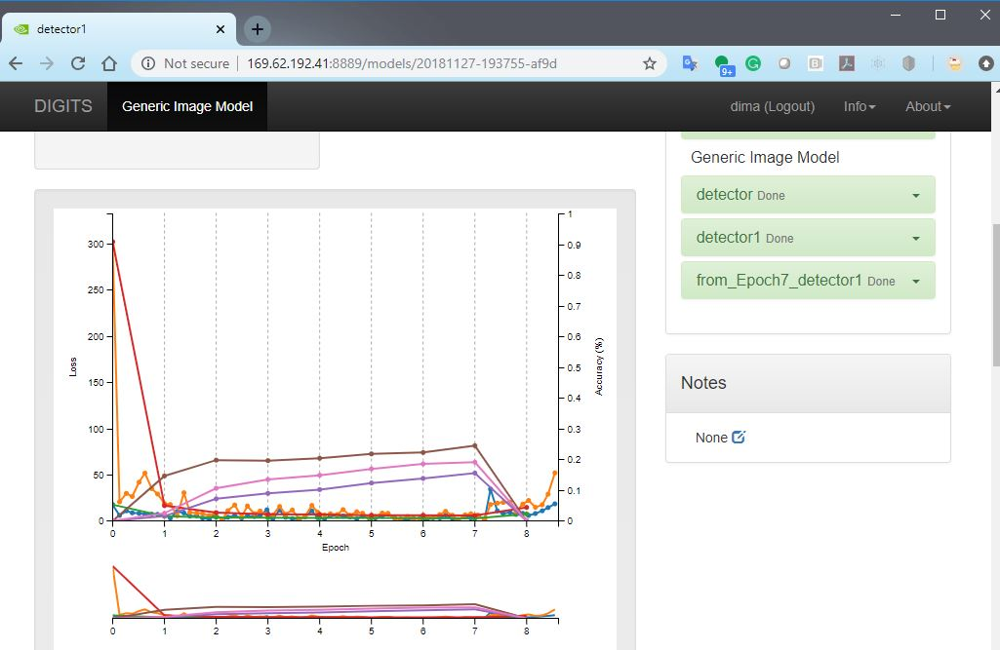
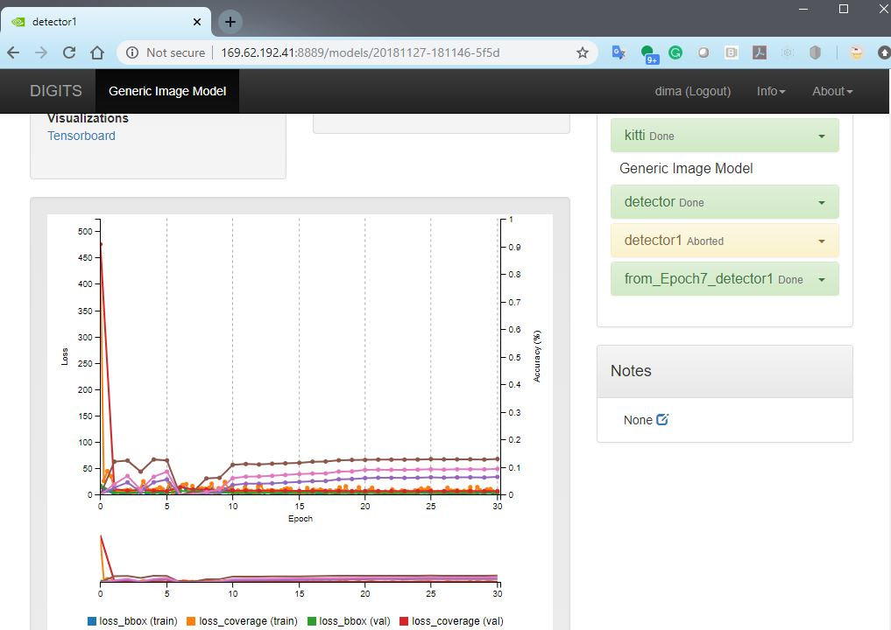
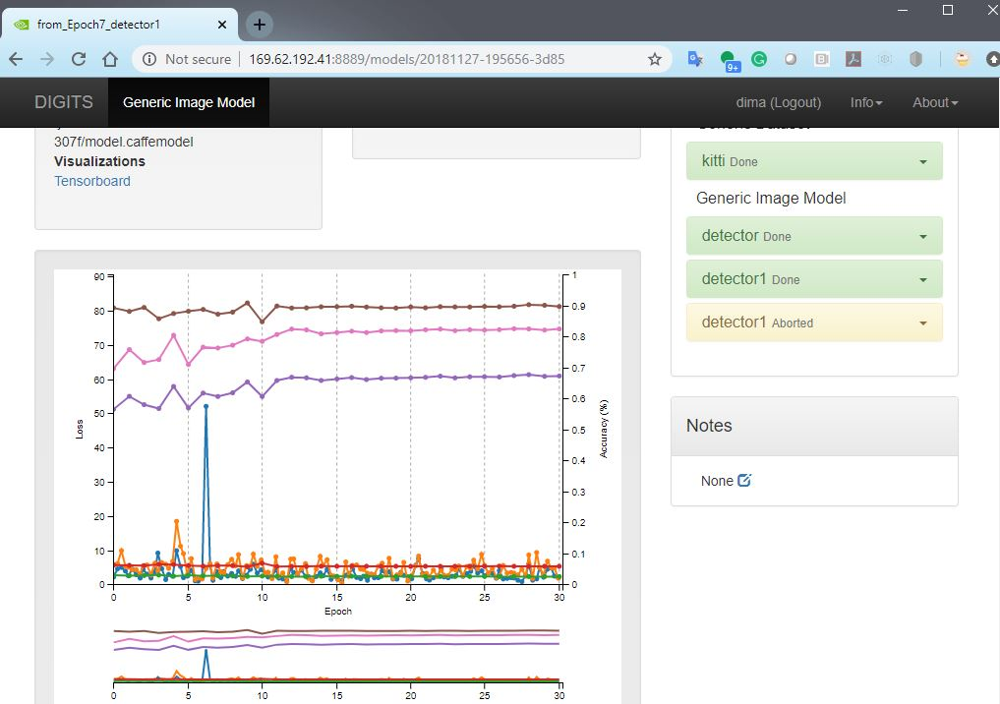

# Homework 7: [ PLEASE DO NOT START; IS BEING REVISED] Object Detection with DIGITS


#### Kitti in the Cloud
This lab follows DIGITS's [Object Detection Example] (https://github.com/NVIDIA/DIGITS/tree/master/examples/object-detection) 

http://169.44.201.108:5000/  is the URL to access our server running a docker container with DIGITS 5 inside.

The instructors have done some work for you already: the `./prepare_kitti_data.py` script has already been run; you need to pick up 
from the LOADING DATA INTO DIGITS section.

The object detection example files are located under /data/DIGITS/examples/object-detection (e.g. kitti data will be in 
/data/DIGITS/examples/object-detection/kitti-data )

We suggest that each student uses a unique "group" for their work -- and as a submittable for the homework just tell us what it is so we can check your work
Tell us where to find your data set and your trained model.  Make sure you validate your model by running it on a few sample images.
How long did it take you? Were you able to achieve the same accuracy as Nvidia? Anything you could do about this?


#### Kitti on the Jetson
We are assuming that you have a running container with Digits in it and your /data folder is passed through to your container. We are following the same object detection guide as above but this will take a little more work.

### Pull the GoogleNet weights
```
cd /data
wget http://dl.caffe.berkeleyvision.org/bvlc_googlenet.caffemodel
```
### Clone the DIGITS 
```
cd /data
git clone https://github.com/NVIDIA/DIGITS.git
```
### Get the KITTI data
Go to the appropriate directort
```
cd /data/DIGITS/examples/object-detection
```
Now, follow the instructions here: https://github.com/NVIDIA/DIGITS/tree/master/examples/object-detection#downloading-and-preparing-the-kitti-data

Once the data is downloaded, run 
```
./prepare_kitti_data.py
```
You can now follow the rest of the guide, just remember that your datasets are located under 
```
/data/DIGITS/examples/object-detection/kitti-data
```
And your pre-trained GoogleNet weights are located under 
```
/data/bvlc_googlenet.caffemodel
```
### Notes on training
If you run the training as suggested in Nvidia github, you likely will not get to the results shown there (mAP over 50%) on the first try.  The set up does not appear to be very stable, and you are more likely to see something like this:

In this case, the mAP suddenly crashed at epoch 8 and we aborted the run.  It would be possible to continue training, and we are likely end up with something like this:

Here, the mAP made a recovery, but not a full one.
However, another idea is to recover from the checkpoint just before the crash, and "roll the dice" again.  Odds are, you will have better luck -- as we had here:

Do give this some thought. This is the essential idea behind transfer learning.

Note that this homework is GRADED

Please submit screenshots of your training runs and the instructions where to find it (if you ran it on the shared instructor's server)
Note that the shared server that we have has a finite capacity and does not have scheduling capabilities.  As a result, you will need to effectively take turns running there.


