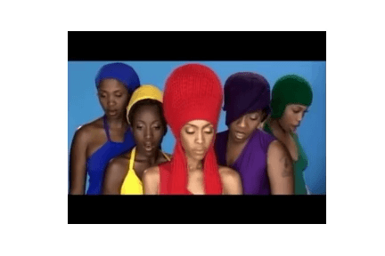
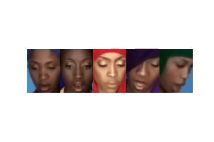
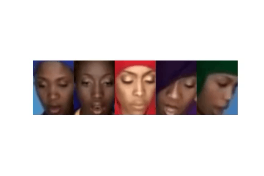

### Video Manipulation

In this lab we will learn,
1. How to scrape videos from youtube.   
2. How to store them as frames in python.  
3. How to manipulate the frames and makes an altered video.   

We show you how to render the video from Erykah Badu's excellent, `Bag Lady`, in colab, like below.    
  
Your task will be to extract the faces from this clip, and render them side by side in a new video like below.   
Please follow the code in the book, we give you and example of how to make one frame. Your task in this step is to apply the same changes to each frame in the stream.    
  
If you get that far you did great!    
However, we see the faces are choppy. If you have time after class (or are completed early in class!) you can try smoothing the bounding box sequences, like below.   
   
We used pandas rolling mean with a windows size of 12 to acieve this. Feel free to ask your instructor for the solution if you are stuck.    

##### Notebook
You can get started in colab [here](https://colab.research.google.com/drive/1Z_laq_NbQc7PZ7RBGiMhDvCjQj8-7E4D?usp=sharing). 
