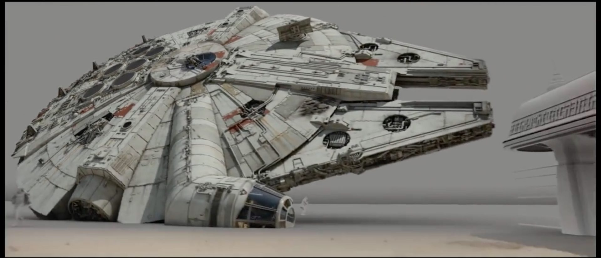

# Homework 8: 
## Part 1: Image Annotation
For this homework, you will be annotating the Millennium Falcon and TIE Fighters in images from Star Wars: The Force Awakens.  

The Millennium Falcon




Three TIE Fighters


Annotations for an image include the object coordinates and the corresponding label or class.
For example, an image with two TIE Fighters will have an annotation similar to:

```xml
<annotation>
    <folder>images</folder>
    <filename>image1.jpg</filename>
    <size>
        <width>1000</width>
        <height>563</height>
    </size>
    <segmented>0</segmented>
    <object>
        <name>Tie Fighter</name>
        <bndbox>
            <xmin>112</xmin>
            <ymin>281</ymin>
            <xmax>122</xmax>
            <ymax>291</ymax>
        </bndbox>
    </object>
    <object>
        <name>Tie Fighter</name>
        <bndbox>
            <xmin>87</xmin>
            <ymin>260</ymin>
            <xmax>95</xmax>
            <ymax>268</ymax>
        </bndbox>
    </object>
</annotation>

```
Spending no more than 3 hours, annotate images, identifying the Millennium Falcon and TIE Fighters.   You will want to use an image tool such as labelImg (https://github.com/tzutalin/labelImg) or RectLabel (macOS only, available in the App Store) and export the annotations in the PASCAL VOC format.  As this requires the user of a user interface, it is recommended that your normal workstation be used.

Images should be annotated with the following rules:

* Rule 1: Include all visible part and draw as tightly as possible.
* Rule 2: If multiple instances, label all instances.
* Rule 3: Occluded parts do not matter as long as all visible parts are included.

Steps (Assuming labelImg):
1. Install the tool, following the steps on https://github.com/tzutalin/labelImg
2. Clone the repository https://github.com/rdejana/MIDS_HW8 into a working directory, e.g. /Users/rdejana/Documents/Homework.  In the subdirectory IDS_HW8/images/, you'll find the images that you'll be annotating.  
3. Create a directory that'll be used to store the annotations, for example /Users/rdejana/Documents/Homework/MIDS_HW8/annotations.
4. Start lalbeImg
5. Click "Open Dir" and select the images directory, e.g. Users/rdejana/Documents/Homework/MIDS_HW8/images
6. Make sure that PascalVOC is displayed under the "Save" icon.
7. Click "Change Save Dir" and set it to your annonations directory.
8. Start annotating.  Select "Create RectBox" and draw the bounds around any instances of Millennium Falcon or TIE Fighers you see in the image, adding the correct label.  When done with an image, press "Save".  Continue on to the next image repeating the process until complete or your reach the time limit.


Questions: 
1.	In the time allowed, how many images did you annotate?  
2.	Home many instances of the Millennium Falcon did you annotate?  How many TIE Fighters?
3.	Based on this experience,  how would you handle the annotation of large image data set?
4.	Think about image augmentation?  How would augmentations such as flip, rotation, scale, cropping, and translation effect the annotations?

## Part 2: Image Augmentation
For part 2, you will need to install docker in a VM or your local workstation.  

1. Run the command:
```bash
       docker run -d -p 8888:8888 ryandejana/hw8augmentation
```
2. If using a VM, open your browser to ```http://<<yourPublicIP>>:8888/notebooks/augmentation.ipynb``` or if local, ```http://127.0.0.1:8888/notebooks/augmentation.ipynb``` and login with the password ```root```.
3. Run the notebook.

If you wish to experiment with the augmenation library, see https://github.com/codebox/image_augmentor

Questions: 
1. Describe the following augmentations in your own words
-	Flip
- 	Rotation
-	Scale
-	Crop
-	Translation
-	Noise

## Part 3: Audio Annotation
Take a look at and explore the audio annotation tool CrowdCurio https://github.com/CrowdCurio/audio-annotator)

Questions:
1.	Image annotations require the coordinates of the objects and their classes; in your option, what is needed for an audio annotation? 

## What to turn  in
### Part 1
1. A zip or tar file of your annoations.
2. Your answers to questions 1 through 4. 

### Part 2
1. Your answer to question 1.

### Part 3
1. Your answer to question 1.

