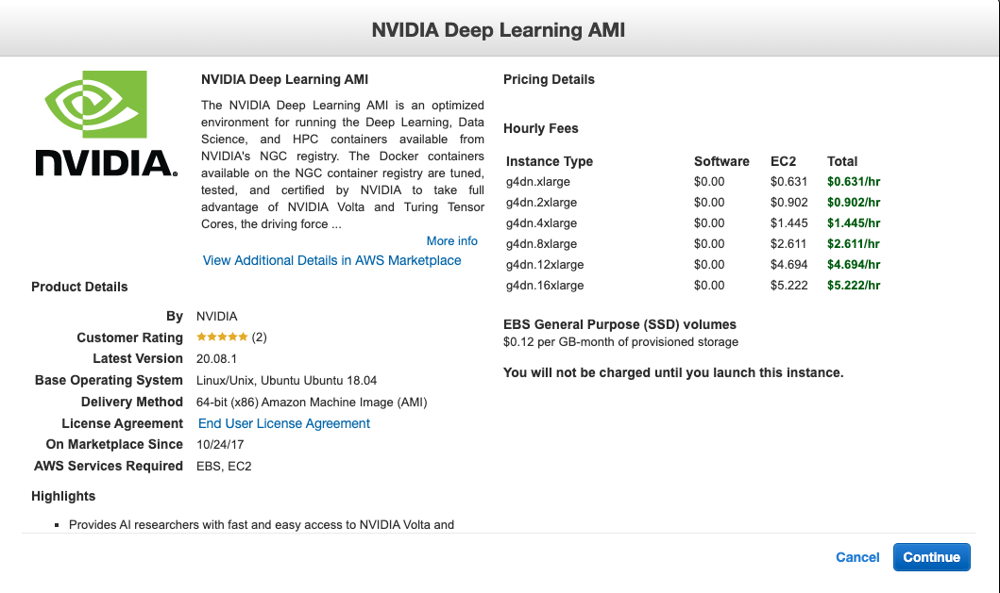
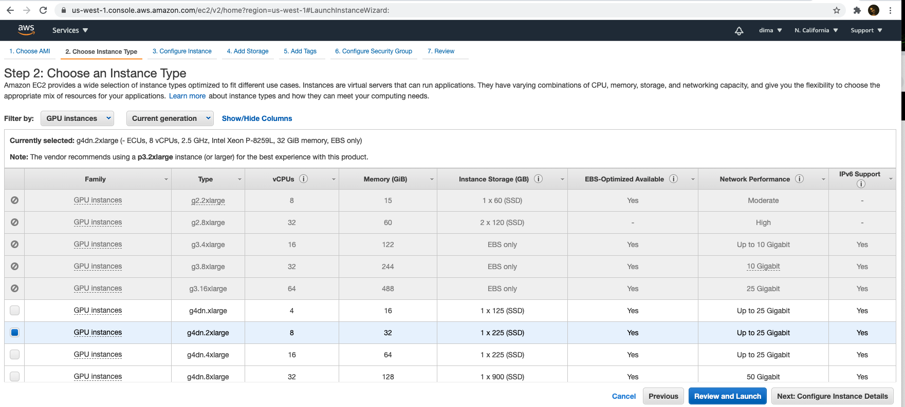
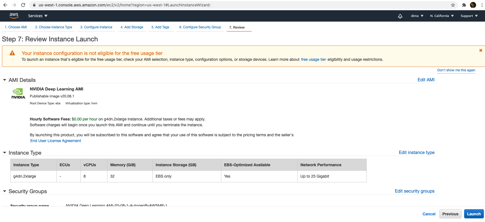
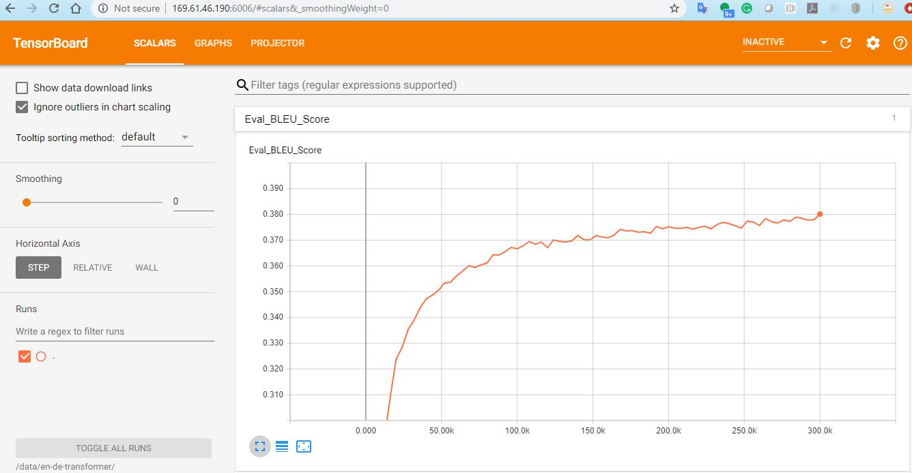
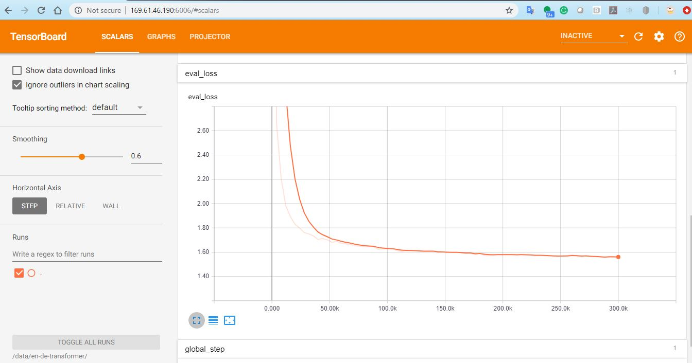
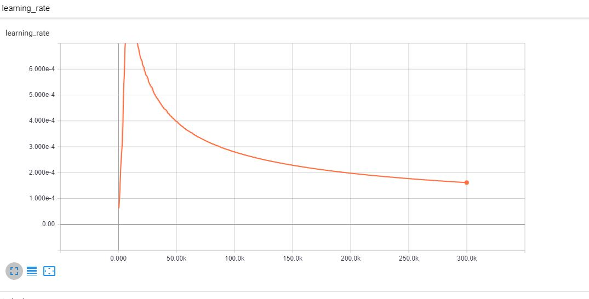

# Homework 9: Distributed Training and Neural Machine Translation

## Please note that this homework is graded
###
This homework requires the limit of VCPU for your AWS account to be raised to 32, so before starting to work on this create a ticket to request the limit increase, use a Service limit increase type of case and add the following explanation for the description:

**Please update the limit for VCPU on my account to be 32 for the g4dn.2xlarge instance type. We are currently running a graded homework in our class at UC Berkeley for the Master in Data Science program about training a Transformer-based Machine Translation network on a small English to German WMT corpus and it uses distributed computing across 4 EC2 instances.**
 
**Without the limit update one of our instructions has the following error:
An error occurred (VcpuLimitExceeded) when calling the RunInstances operation: You have requested more vCPU capacity than your current vCPU limit of 8 allows for the instance bucket that the specified instance type belongs to. Please visit http://aws.amazon.com/contact-us/ec2-request to request an adjustment to this limit.**

Notice that this request takes at least a couple of days to be processed, so plan accordingly.


### Read up on OpenSeq2Seq
Nvidia [OpenSeq2Seq](https://github.com/NVIDIA/OpenSeq2Seq/) is a framework for sequence to sequence tasks such as Automatic Speech Recognition (ASR) and Natural Language Processing (NLP), written in Python and TensorFlow 1.X. Many of these tasks take a very long to train, hence the need to train on more than one machine.  In this week's lab, we'll be training a [Transformer-based Machine Translation network](https://nvidia.github.io/OpenSeq2Seq/html/machine-translation/transformer.html) on a small English to German WMT corpus.

### Get four T4 GPU VMs in AWS EC2

### Start your VMs and notebook as below.  
    
Use this command to pick out your default vpc, note, it is the vpc with `"IsDefault": true`.
```
aws ec2 describe-vpcs | grep VpcId
```
My one is `vpc-e4e35381`, I shall use this below. 

Now create a security group which will allow us to login and expose a port for a Jupyter notebook to be run. 
```
aws ec2 create-security-group --group-name hw09 --description "HW09" --vpc-id vpc-e4e35381
sg-0be9d9ccd3efee363
```

Now lets start the image. Please use the Nvidia Deep Learning AMI

```
aws ec2 run-instances --image-id ami-0dc2264cd927ca9eb --instance-type g4dn.2xlarge --security-group-ids sg-0be9d9ccd3efee363  --associate-public-ip-address --key-name eariasn --count 4
```



     
Again, it will take a couple of minutes to create. You can get the server address by using the below. 
```
aws ec2 describe-instances | grep ec2   
```

In the security group that these instances belong to, we will need to enable all ports (1-65535) - otherwise, mpi will fail, use this an example change the values of the parameters to your environment.

```
aws ec2 authorize-security-group-ingress --group-id  sg-0a53b2b5dd9742d84  --protocol tcp --port 1-65535 --cidr 0.0.0.0/0
```
    
We will also need our public IP later for running Jupyter. `aws ec2 describe-instances | grep PublicIp`
My public ip is `54.194.227.21`


Now we login, 
```
ssh -i "darraghaws.pem" ubuntu@ec2-54-194-227-21.eu-west-1.compute.amazonaws.com
```

You will need to create an AWS Elastic File Storage Service (EFS) instance and mount it on all nodes (e.g. under ~/data)


### EFS volume and mount target creation
```
# aws efs create-file-system --region us-east-1 
Get the EFS ID: fs-20feafa2

# aws efs create-mount-target --file-system-id fs-20feafa2 --subnet-id subnet-0210c44a6afecc858 --security-group sg-0a53b2b5dd9742d84 --region us-east-01
172.31.67.44 
Get the IP address, notice that your EC2 subnet id and security group id would be different, get those from CLI or AWS Consoles.
```
### EC2 instance volume mount operation.
Notice the ip address is going to be different from this example.
```
## These first three steps are to bring the docker file in to your home directory. 
# cd ~
# git clone https://github.com/MIDS-scaling-up/v2.git
# cp -r v2/week09/hw/docker .
# mkdir ~/data
# sudo mount -t nfs -o nfsvers=4.1,rsize=1048576,wsize=1048576,hard,timeo=600,retrans=2,noresvport 172.31.67.44:/ ~/data
# cd ~/data
# sudo chmod go+rw .
```
Bonus points, explore to mount the directories permanently with FSTAB.

### Create cloud containers for openseq2seq and distributed training


1. Use the files on [docker directory](docker) to create an openseq2seq image 
1. Copy the created docker image to the other VM (or repeat the same steps on the other 4 VMs) 
1. Create containers on both VMs: ``` docker run --runtime=nvidia -d --name openseq2seq --net=host -e SSH_PORT=4444 -v ~/data:/data -p 6006:6006 openseq2seq ```
1. Notice that it is important to run these containers in the -d mode as inside them we are starting sshd on port 4444 and this port will be used for communication between them
1. On each VM, create an interactive bash sesion inside the container: ``` docker exec -ti openseq2seq bash ``` and run the following commands in the container shell:
    1. Test mpi: ``` mpirun -n 4 -H <vm1 private ip address>,<vm2 private ip address>,<vm3>,<vm4> --allow-run-as-root hostname ``` 
    1. Make a change in scripts/get_en_de.sh -   
        From:
       ```
       echo "Downloading Europarl v7. This may take a while..."
       curl -o ${OUTPUT_DIR_DATA}/europarl-v7-de-en.tgz \
       http://www.statmt.org/europarl/v7/de-en.tgz
       echo "Downloading Common Crawl corpus. This may take a while..."
       curl -o ${OUTPUT_DIR_DATA}/common-crawl.tgz \
       http://www.statmt.org/wmt13/training-parallel-commoncrawl.tgz 
       ```
       To:
       ``` 
       echo "Downloading Europarl v7. This may take a while..."
       curl -o ${OUTPUT_DIR_DATA}/europarl-v7-de-en.tgz \
       https://www.statmt.org/europarl/v7/de-en.tgz
       echo "Downloading Common Crawl corpus. This may take a while..."
       curl -o ${OUTPUT_DIR_DATA}/common-crawl.tgz \
       https://www.statmt.org/wmt13/training-parallel-commoncrawl.tgz 
       ```
    1. Assuming that you have mounted your EFS on /data, run this on node1 only. Pull data to be used in neural machine tranlsation training ([more info](https://nvidia.github.io/OpenSeq2Seq/html/machine-translation.html)).  this may take up to 6 hours, depending on your luck and network conditions:  
    ``` 
    cd /opt/OpenSeq2Seq 
    scripts/get_en_de.sh /data/wmt16_de_en
    ```
    1. Copy configuration file to /data directory: ``` cp example_configs/text2text/en-de/transformer-base.py /data ```
    1. Edit /data/transformer-base.py: replace ```[REPLACE THIS TO THE PATH WITH YOUR WMT DATA]``` with ```/data/wmt16_de_en/```,  in base_parms section replace ```"logdir": "nmt-small-en-de",``` with ```"logdir": "/data/en-de-transformer/",```  make "batch_size_per_gpu": 128, and the in eval_params section set "repeat": to True. 
    1. Even though we are using T4 GPUs, we are not going to use mixed precision here.  Please set  "batch_size_per_gpu": 128 (yes, you can fit twice as much data in memory if you are using 16-bit precision but this particular network will diverge if you try that)
    1. Start training -- **on the first VM only:** ```nohup mpirun --allow-run-as-root -n 4 -H internal_ip1:1,internal_ip2:1,internal_ip3:1,internal_ip4:1 -bind-to none -map-by slot --mca btl_tcp_if_include ens5 -x NCCL_SOCKET_IFNAME=ens5 -x NCCL_DEBUG=INFO -x LD_LIBRARY_PATH python run.py --config_file=/data/transformer-base.py --use_horovod=True --mode=train_eval & ```
    1. Note that the above command starts 4 total tasks (-n 4), one on each node (-H <vm1 private ip address>:1,<vm2 private ip address>:1,...), asks the script to use horovod for communication, which in turn, uses NCCL, and then forces NCCL to use the internal nics on the VMs for communication (-x NCCL_SOCKET_IFNAME=ens5). Please double check that your VMs use ens5 as the name of the internal NIC (`apt update && apt install -y net-tools` followed by `ifconfig` ) Mpi is only used to set up the cluster. 
    1. Monitor training progress: ``` tail -f nohup.out ```
    1. Start tensorboard on the same machine where you started training, e.g. ```nohup tensorboard --logdir=/data/en-de-transformer``` You should be able to monitor your progress by putting http://public_ip_of_your_vm1:6006 !
    1. Run the training for 50,000 or 100,000 steps (the config file will make the model run for 300,000 steps unless you change the max_steps parameter).  This will cost you about $100-$200 in total as each T4 costs about $0.90 / hour. Please check your tensorboard against the 300,000 step plot below to ensure that it is consistent.
    1. After your training is done, download your best model to your jetson NX.  [Hint: it will be located in /data/en-de-transformer]  Alternatively, you could always cheat and download a checkpoint from Nvidia [here](https://nvidia.github.io/OpenSeq2Seq/html/machine-translation.html)
 
### Submission

Please submit the nohup.out file along with screenshots of your Tensorboard indicating training progress (Blue score, eval loss) over time.  Also, answer the following (simple) questions:
* How long does it take to complete the training run? (hint: this session is on distributed training, so it *will* take a while)
* Do you think your model is fully trained? How can you tell?
* Were you overfitting?
* Were your GPUs fully utilized?
* Did you monitor network traffic (hint:  ```apt install nmon ```) ? Was network the bottleneck?
* Take a look at the plot of the learning rate and then check the config file.  Can you explan this setting?
* How big was your training set (mb)? How many training lines did it contain?
* What are the files that a TF checkpoint is comprised of?
* How big is your resulting model checkpoint (mb)?
* Remember the definition of a "step". How long did an average step take?
* How does that correlate with the observed network utilization between nodes?

### Hints
Your BLEU TB plot should look something like this:


Your loss should be something like:


And your learning rate  should be something like:

