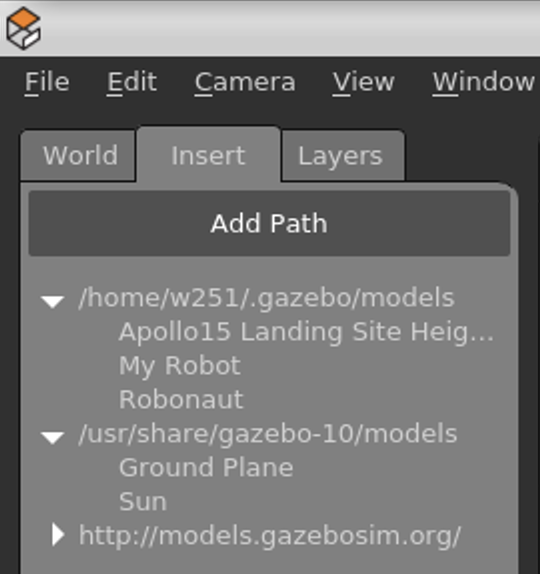
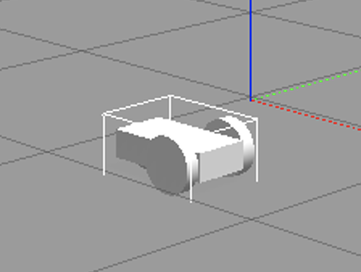
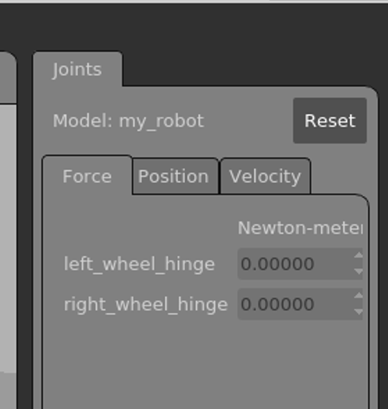
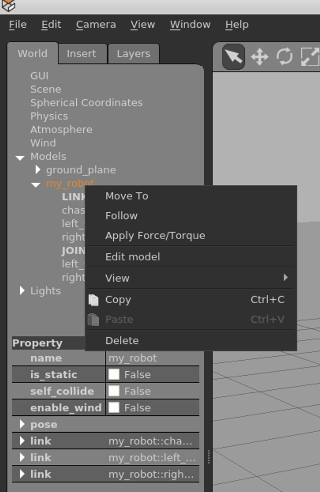

# Intro to Gazebo

Gazebo is a robotics simulator used to build and test robots in a 3D environment with a physics engine for running simulations and a graphical environment to watch them.

In this homework, you will go through a demo to build a simple robot, then build one of your own.

**Your homework submission will be the .sdf file and .config file so we can run the simulation on our own Gazebo environment.**

The first step is to create a VM from the base image created with Gazebo pre-installed:

```
ibmcloud sl vs create --datacenter=lon06 --hostname=cpus --domain=myhost.com --billing=hourly  --network=1000  --flavor=C1_16X16X100 --san --image=2299227 --key=XXXXXXX
```

Make sure you replace `XXXXXXX` with your ssh key ID. You can also choose a data center that's closer to you geographically.

The VM will need ssh access disabled for password authentication (refer to homework 2 if you need help).

You can connect using either Microsoft Remote Desktop Protocol (from Windows or Mac) or TurboVNC.

RDP connection: user id `w251` password `thisisalongpassword`

TurboVNC connection: ssh to the node and run `/opt/TurboVNC/bin/vncserver` to start the VNC Server. You can download the VNC client from [here](https://sourceforge.net/projects/turbovnc/files/2.2.2/). The default VNC password is `quarter` and can be changed with the `/opt/TurboVNC/bin/vncpasswd` command.

Once you connect to the desktop, start a Terminal window (using the launch icon at the bottom of the screen) and launch the Gazebo application with the `gazebo` command.

## Create a robot
This robot comes from the gazebosim website: http://gazebosim.org/tutorials?tut=build_robot&cat=build_robot

This is a simple robot (called `My Robot`) that is pre-loaded in your Gazebo software. It is on the Insert tab:



If you select `My Robot`, you can place it into the 3D grid:



You can now make the robot move around. Drag the three dots on the right side of the screen to the left to expose the Joints pane:



and give a value (like `0.020`) to one or both wheels. If you don't see the hinge values, click on the robot to select it (there should be a white wireframe around it).

### Looking at the components in the model
The sdf file (model.sdf from this repo) has the following components to build the robot:

#### Chassis
```
          <link name='chassis'>
            <pose>0 0 .1 0 0 0</pose>

            <collision name='collision'>
              <geometry>
                <box>
                  <size>.4 .2 .1</size>
                </box>
              </geometry>
            </collision>

            <visual name='visual'>
              <geometry>
                <box>
                  <size>.4 .2 .1</size>
                </box>
              </geometry>
            </visual>
          </link>
```
The robot chassis has two components, `collision` and `visual`. The collision component specifies the shape for the collision detection engine (the physics) and the visual component is used for the rendering engine.

#### Caster
```
          <collision name='caster_collision'>
            <pose>-0.15 0 -0.05 0 0 0</pose>
            <geometry>
                <sphere>
                <radius>.05</radius>
              </sphere>
            </geometry>

            <surface>
              <friction>
                <ode>
                  <mu>0</mu>
                  <mu2>0</mu2>
                  <slip1>1.0</slip1>
                  <slip2>1.0</slip2>
                </ode>
              </friction>
            </surface>
          </collision>

          <visual name='caster_visual'>
            <pose>-0.15 0 -0.05 0 0 0</pose>
            <geometry>
              <sphere>
                <radius>.05</radius>
              </sphere>
            </geometry>
          </visual>
```
The caster is a ball that sits on the bottom of the robot and acts as a wheel. It also has a collision element (which has a surface element to define the friction) and a visual element.

#### Left wheel
```
      <link name="left_wheel">
        <pose>0.1 0.13 0.1 0 1.5707 1.5707</pose>
        <collision name="collision">
          <geometry>
            <cylinder>
              <radius>.1</radius>
              <length>.05</length>
            </cylinder>
          </geometry>
        </collision>
        <visual name="visual">
          <geometry>
            <cylinder>
              <radius>.1</radius>
              <length>.05</length>
            </cylinder>
          </geometry>
        </visual>
      </link>
```

#### Right wheel
```
      <link name="right_wheel">
        <pose>0.1 -0.13 0.1 0 1.5707 1.5707</pose>
        <collision name="collision">
          <geometry>
            <cylinder>
              <radius>.1</radius>
              <length>.05</length>
            </cylinder>
          </geometry>
        </collision>
        <visual name="visual">
          <geometry>
            <cylinder>
              <radius>.1</radius>
              <length>.05</length>
            </cylinder>
          </geometry>
        </visual>
      </link>
```

#### Wheel joints
```
      <joint type="revolute" name="left_wheel_hinge">
        <pose>0 0 -0.03 0 0 0</pose>
        <child>left_wheel</child>
        <parent>chassis</parent>
        <axis>
          <xyz>0 1 0</xyz>
        </axis>
      </joint>

      <joint type="revolute" name="right_wheel_hinge">
        <pose>0 0 0.03 0 0 0</pose>
        <child>right_wheel</child>
        <parent>chassis</parent>
        <axis>
          <xyz>0 1 0</xyz>
        </axis>
      </joint>
```

Your robot should be driving around now.

## Build your own robot
You can delete the model robot from the screen by right-clicking on it in the `World` tab:



Your assignment is to build a new robot with six legs and a grabber claw.

You can use the existing assets on the `Insert` tab in Gazebo from http://models.gazebosim.org.

The tutorials on http://gazebosim.org/tutorials are also excellent examples.

Here is an excellent example of starting a new project in Gazebo:

http://gazebosim.org/tutorials?tut=build_robot&cat=build_robot

Attach the `.sdf` and `.config` files to your homework submission.

## The VM is expensive and should be canceled when you are done