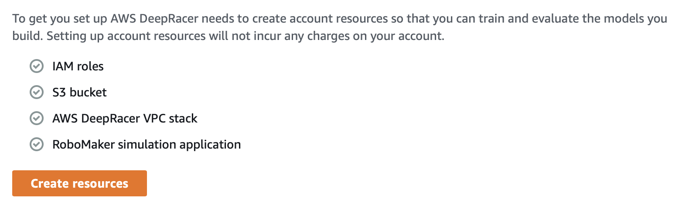

# AWS DeepRacer Lab
In this lab, we will look at the AWS DeepRacer project. You will design a Reinforcement Learning training program for a virtual car on a virtual track by tweaking parameters like steering and speed.

First, go to the [DeepRacer portal](https://console.aws.amazon.com/deepracer/home?region=us-east-1).

## Step 0
Create account resources (Required / ~5 mins)

You will see a button to create all the required resources:

## Step 1
Learn the basics of reinforcement learning (Optional / ~10 mins)

**You can skip this step because we will discuss in class.**

## Step 2
Create a model and race (Required / ~1 hour)

Click the "Create Model" button and fill out the details:

 - Model name
 - Environment Simulation **Pick the re:Invent 2018 track for this lab**
 - Action Space **Tweak the steering angle, granularity, speed, speed granularity however you please**
 - Use the default reward function
 - Use the default Hyperparameters
 - Use the default stop condition of 60 minutes

## Start your training
Click the button to start the training
 
## Check your results
After the training is complete, run an evaluation of the model. 

 - How far did your car go? 
 - Compare your results to others. 
 - Did you change any parameters that made your model perform better or worse? 
 - Does your car run very well on other tracks?
